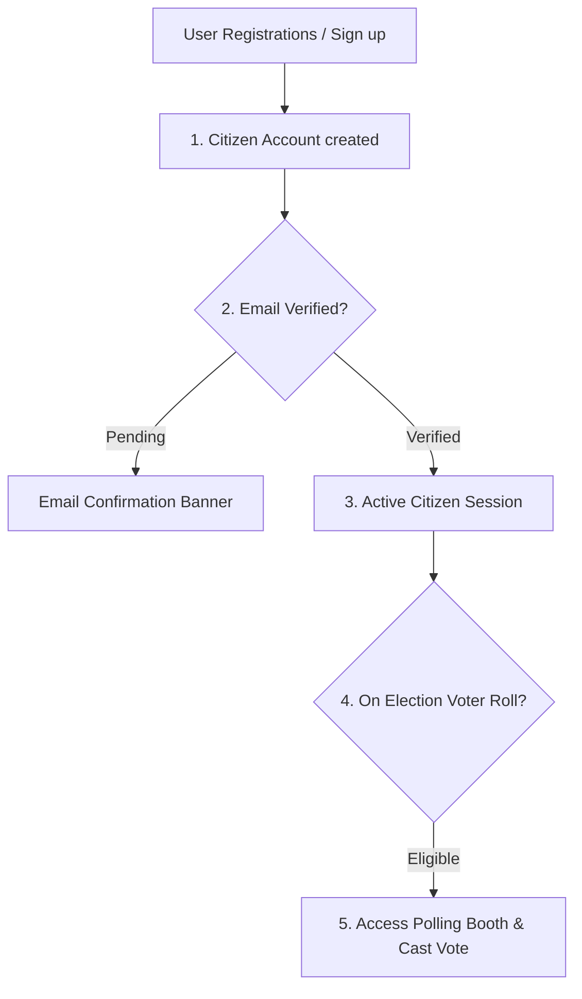

# DigiVote System Architecture Specification

This document defines the target high-level software architecture, component relationships, module boundaries, backend application directories, frontend layouts, and comprehensive API endpoints for the **DigiVote** platform.

---

## 1. High-Level Architecture Overview

DigiVote uses a decoupled modern web application architecture designed for maximum performance, security, and anonymity:

```
                  ┌────────────────────────────────────────┐
                  │          React Frontend Client         │
                  │  (React Router, Axios, Context API,   │
                  │   Tailwind CSS - JavaScript ONLY)      │
                  └───────────────────┬────────────────────┘
                                      │
                                      ▼ HTTPS Requests
                  ┌────────────────────────────────────────┐
                  │         Django REST Framework          │
                  │        (Authentication, Auditing,      │
                  │         Session Security, Elections)   │
                  └───────┬────────────────────────┬───────┘
                          │                        │
                          ▼ SQL Queries            ▼ Session Checks
┌───────────────────────────────────┐    ┌───────────────────────────────────┐
│        PostgreSQL Database        │    │         Security Subsystems       │
│  (Connection Pooler,              │    │  (Lockout, Rate Throttling,       │
│   UUIDs, Envelope AES Keys)       │    │   Audit Trail Logging)            │
└───────────────────────────────────┘    └───────────────────────────────────┘
```

---

## 2. Component Responsibility Segmentation

The application strictly separates user registrations from election voter rolls:



1. **Website Account (`accounts` / `authentication` app)**: Governs portal credentials (username, email, password, Google OAuth claims, MFA OTP, session management).
2. **Eligible Voter Roll (`elections` app)**: Evaluates if a registered user or email is listed on the eligible voter roll for a specific election.
3. **Ballot & Tally (`voting` app)**: The independent digital ballot box with AES-256 envelope encryption. Completely detached from citizen records to ensure voter secrecy.

---

## 3. Backend Django App Structure

1. **`accounts`**: User accounts, profile, and session management.
2. **`authentication`**: Core user signup, credential logins, token issuance, and OTP verifications.
3. **`locations`**: Administrative mapping of states, districts, and assembly boundaries.
4. **`elections`**: Election lifecycle management, eligible voter rolls, candidate configurations, and audit trails.
5. **`voting`**: Cryptographic voting booth, encrypted ballots, and tally engine.
6. **`security`**: Lockout protection, rate throttling, and security events.
7. **`audit`**: Immutable system audit logs.

---

## 4. Frontend Folder Architecture

```
frontend/src/
├── assets/          # Static assets: images, local icons
├── components/      # Reusable UI controls (Buttons, Cards, Modals)
├── context/         # React Context stores for authentication, themes, toasts
├── layouts/         # Page structures: Header, Sidebar, DashboardLayout
├── pages/           # Route targets (Dashboard, Elections, Vote, Results)
├── services/        # Axios API fetch modules (auth, electionsApi, voting)
├── utils/           # Helper scripts (validators, date formatters)
├── index.css        # Main stylesheet importing Tailwind
└── main.jsx         # App entry point
```

---

## 5. API Endpoints Map

### 5.1. Authentication & Sessions (Modules 1 - 7)
* `POST /api/auth/register/` - Account registration.
* `POST /api/auth/login/` - Portal login credentials submission.
* `POST /api/auth/verify-email/` - Email address verification.
* `POST /api/auth/otp/verify/` - Validates MFA OTP code.
* `GET /api/auth/sessions/` - Lists active citizen device sessions.
* `POST /api/auth/sessions/revoke-all/` - Revokes sessions across devices.
* `GET /api/auth/security-activity/` - Citizen security audit timeline.

### 5.2. Elections & Creator Operations (Modules 8 - 11)
* `GET, POST /api/elections/` - List and create elections.
* `GET /api/elections/voter-overview/` - List active elections voter is eligible for.
* `GET, POST /api/elections/<id>/voters/` - Voter roll management.
* `POST /api/elections/<id>/voters/bulk-upload/` - Bulk CSV upload of eligible voters.
* `GET, POST /api/elections/<id>/candidates/` - Candidate configuration.
* `PATCH /api/elections/<id>/verification-config/` - Per-election verification flags.
* `PATCH /api/elections/<id>/rules/` - Scheduling and result visibility rules.
* `POST /api/elections/<id>/start/` - Start election.
* `POST /api/elections/<id>/stop/` - Emergency stop.

### 5.3. Voting & Results (Module 12)
* `GET /api/elections/<id>/ballot/` - Fetch election ballot.
* `POST /api/elections/<id>/ballot/confirm/` - Request vote confirmation token.
* `POST /api/elections/<id>/ballot/submit/` - Submit encrypted ballot choice.
* `GET /api/elections/<id>/results/` - View published election results.
