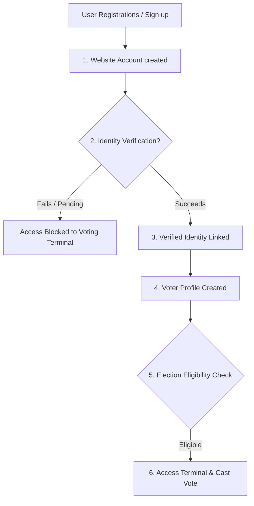

# DigiVote System Architecture Specification

This document defines the target high-level software architecture, component relationships, module boundaries, backend application directories, frontend layouts, and comprehensive API endpoints for the **DigiVote** platform.

---

## 1. High-Level Architecture Overview

DigiVote uses a decoupled modern web application architecture designed for maximum performance, security, and anonymity:

```
                  ┌────────────────────────────────────────┐
                  │          React Frontend Client         │
                  │  (React Router, Axios, Context API,   │
                  │   Tailwind CSS - JavaScript ONLY)      │
                  └───────────────────┬────────────────────┘
                                      │
                                      ▼ HTTPS Requests
                  ┌────────────────────────────────────────┐
                  │         Django REST Framework          │
                  │        (Authentication, Auditing,      │
                  │         Verification, Elections)       │
                  └───────┬────────────────────────┬───────┘
                          │                        │
                          ▼ SQL Queries            ▼ API Requests
┌───────────────────────────────────┐    ┌───────────────────────────────────┐
│        Supabase PostgreSQL        │    │    External Identity Providers    │
│  (PgBouncer Connection Pooler,   │    │  (DigiLocker OAuth 2.0 gateway,   │
│   UUIDs, pgvector Embeddings)     │    │   UIDAI Aadhaar Verification)     │
└───────────────────────────────────┘    └───────────────────────────────────┘
```

---

## 2. Component Responsibility Segmentation

The application strictly separates user registrations from official voter parameters to prevent automatic verification on signup.



1. **Website Account (`users` app)**: Governs portal credentials (username, email, password, Google OAuth claims). Account registration does NOT grant voter status.
2. **Verified Identity (`identity` app)**: Manages third-party validation statuses (DigiLocker credential payloads, verified Aadhaar matches).
3. **Voter Profile (`voters` app)**: Stores demographics, polling stations, and constituency data.
4. **Election Eligibility (`elections` app)**: Evaluates if a profile has permissions to access an active election ballot based on their constituency.
5. **Vote (`voting` app)**: The independent digital ballot box. Completely detached from voter profiles to ensure secrecy.

---

## 3. Backend Django App Structure

The Django project is refactored into 17 modular, decoupled applications under the backend project root, ensuring separation of duties:

1. **`authentication`**: Core user signup, credential logins, token issuance, and OTP verifications.
2. **`identity`**: Manages verification configurations and maps user profiles to third-party ID providers.
3. **`voters`**: Handles voter registration profiles and Voter ID Card issuance.
4. **`constituencies`**: Administrative mapping of states, districts, and assembly boundaries.
5. **`elections`**: Election setup, status progression, and metadata schedules.
6. **`candidates`**: Candidate registration, biographies, party associations, and approval workflows.
7. **`voting`**: The anonymous ballot box system, transaction concurrency guards, and random delay queues.
8. **`verification`**: Centralized verification dashboard middleware.
9. **`face_auth`**: Integrates webcam frames audit checkpoints and generates/compares ArcFace vector embeddings.
10. **`webauthn_auth`**: Handles WebAuthn key registrations, challenge generation, and cryptographical sign validation.
11. **`digilocker`**: DigiLocker OAuth 2.0 handshake endpoints and document fetch clients.
12. **`aadhaar`**: Aadhaar provider abstractions and mock interface classes.
13. **`notifications`**: Dispatches alerts, emails, and SMS codes.
14. **`security`**: Handles rate limit logging, session timeouts, and malicious injection filters.
15. **`audit`**: Houses the immutable, append-only `AuditLog` ledger.
16. **`reports`**: Compilation of election analytics and Excel file export utilities.
17. **`support`**: Ticket filing system for citizens experiencing identity lockouts or biometric failures.

---

## 4. Frontend Folder Architecture

The frontend is written strictly in **JavaScript (no TypeScript)**, styled using **Vanilla CSS and Tailwind CSS**, and structured as follows:

```
frontend/src/
├── assets/          # Static assets: images, local icons
├── components/      # Reusable UI controls (Buttons, Cards, Modals, Camera)
├── context/         # React Context stores for authentication, themes
├── hooks/           # Custom React hooks (useAuth, useLocalStorage, useCamera)
├── layouts/         # Page structures: Header, Footer, AdminLayout, PortalLayout
├── pages/           # Route targets (Landing, Login, Terminal, Results)
├── services/        # Axios API fetch modules (authService, electionService)
├── utils/           # Helper scripts (validators, date formatters, crypto hashing)
├── index.css        # Main stylesheet importing Tailwind
└── main.jsx         # App entry point
```

---

## 5. API Endpoints Map

All requests route through `/api/v1/` and return clean JSON payloads:

### 5.1. Authentication & Google OAuth
* `POST /api/v1/auth/register/` - Direct portal account registration.
* `POST /api/v1/auth/login/` - Portal login credentials submission.
* `POST /api/v1/auth/logout/` - Token revocation and session termination.
* `POST /api/v1/auth/otp/` - Triggers a new 2FA verification OTP dispatch.
* `POST /api/v1/auth/otp/verify/` - Validates the submitted OTP.
* `POST /api/v1/google/login/` - Forward Google's Identity Token (`id_token`) for backend validation.

### 5.2. Verification & Integrations
* `POST /api/v1/identity/verify/` - Initializes identity verification flow.
* `GET /api/v1/digilocker/connect/` - Returns the authorize URL redirecting to DigiLocker.
* `GET /api/v1/digilocker/callback/` - Handles code exchanges and reads verifiable claims.
* `POST /api/v1/aadhaar/request-otp/` - Requests an OTP dispatch viaUIDAI abstraction.
* `POST /api/v1/aadhaar/verify-otp/` - Submits the UIDAI e-KYC code for registration verification.

### 5.3. Biometrics Subsystem
* `POST /api/v1/face/verify/` - Uploads captured webcam frames for liveness and ArcFace matching.
* `GET /api/v1/webauthn/register/` - Generates passkey challenge parameters for the browser.
* `POST /api/v1/webauthn/register/verify/` - Cryptographically registers the public key assertion.
* `GET /api/v1/webauthn/login/` - Fetches login challenge parameters.
* `POST /api/v1/webauthn/login/verify/` - Validates passkey signature assertion.

### 5.4. Voter Registry & Boundaries
* `GET /api/v1/voters/me/` - Retrieves active voter profile.
* `POST /api/v1/voters/me/card/` - Requests Voter ID Card generation.
* `GET /api/v1/constituencies/` - Lists constituencies.

### 5.5. Elections & Voting Terminal
* `GET /api/v1/elections/` - Lists active, scheduled, and completed elections.
* `GET /api/v1/elections/<id>/candidates/` - Lists candidates filter-scoped to the voter's constituency.
* `POST /api/v1/voting/cast/` - Submits biometric signature and ballot choice (enclosed in atomic block).
* `GET /api/v1/receipts/<receipt_number>/` - Public check verification verifying ballot inclusion.
* `GET /api/v1/results/<election_id>/` - Standings and constituency-wise turnouts.

### 5.6. Administration, Security & Auditing
* `GET /api/v1/admin/summary/` - Aggregated metrics dashboard.
* `GET /api/v1/admin/voters/pending/` - Queue of voter verification requests.
* `POST /api/v1/admin/voters/<id>/approve/` - Administrator sign-off on a voter's profile.
* `POST /api/v1/admin/candidates/approve/` - Administrative candidate validation.
* `GET /api/v1/security/events/` - Logs brute force and session hijacking incidents.
* `GET /api/v1/audit/logs/` - Immutable audit ledger feed.
