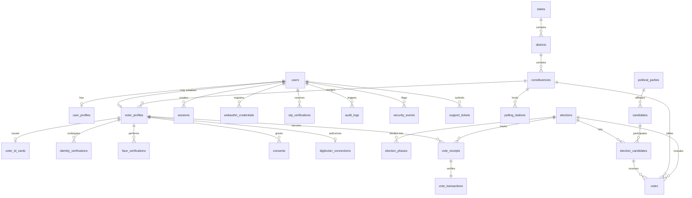

# DigiVote Database Design Specification

This document details the Supabase PostgreSQL database schema layout for the **DigiVote** platform. To support secure, high-concurrency real-world voting while maintaining complete anonymity, the schema strictly isolates core user accounts from verified voter identities, and decouples voter logs from ballot records.

---

## 1. Entity Relationship Diagram

Below is the conceptual entity relationship model illustrating the separation of **Account**, **Identity Verification**, **Voter Registry**, and the **Decoupled Ballot Box**:

---

## 2. Core Architectural Separation Rules

To prevent admin tracking or data correlation attacks, the database design enforces these absolute boundaries:
1. **No Link Back to Voter**: The `votes` table contains NO foreign keys, logical indices, or references linking back to `users`, `voter_profiles`, or `vote_receipts`.
2. **Account vs. Voter**: Creating a `users` record (e.g., via Google OAuth or Registration) does not automatically generate a `voter_profiles` record. The voter profile is created only after successful Aadhaar/DigiLocker verification.
3. **Cryptographic Blinding**: The `vote_receipts` table records *that* a profile voted in an election, while the actual candidate choice goes into `votes` as an independent record. These write operations are bundled in an atomic database transaction.

---

## 3. Detailed Schema Definitions

All primary keys use **UUIDv4** to prevent enumeration attacks (IDOR) and facilitate secure decentralized ID generation.

### 3.1. Authentication & Account Subsystem

#### Table: `users`
Represents the core application user credential store.
* `id` (UUID, Primary Key, Default: `uuid_generate_v4()`)
* `username` (VARCHAR(150), Unique, Indexed)
* `email` (VARCHAR(255), Unique, Indexed)
* `password_hash` (VARCHAR(255))
* `is_active` (BOOLEAN, Default: `TRUE`)
* `is_staff` (BOOLEAN, Default: `FALSE`) - Django administrative access.
* `role` (VARCHAR(20)) - Choices: `ADMIN`, `VOTER`, `AUDITOR`.
* `phone_number` (VARCHAR(15), Nullable, Unique)
* `created_at` (TIMESTAMP WITH TIME ZONE, Default: `CURRENT_TIMESTAMP`)
* `updated_at` (TIMESTAMP WITH TIME ZONE, Default: `CURRENT_TIMESTAMP`)

#### Table: `user_profiles`
Stores supplemental non-auth user metadata.
* `id` (UUID, Primary Key, Default: `uuid_generate_v4()`)
* `user_id` (UUID, Foreign Key -> `users.id`, Unique, Cascade Delete)
* `google_oauth_id` (VARCHAR(255), Nullable, Unique, Indexed) - Stored for external login matching.
* `full_name` (VARCHAR(255))
* `profile_picture_url` (TEXT, Nullable)
* `preferred_language` (VARCHAR(10), Default: `'en'`)

#### Table: `webauthn_credentials`
Stores hardware authenticator and passkey credentials.
* `id` (UUID, Primary Key, Default: `uuid_generate_v4()`)
* `user_id` (UUID, Foreign Key -> `users.id`, Indexed)
* `credential_id` (VARCHAR(512), Unique, Indexed) - Hex/Base64 key identifier.
* `public_key` (TEXT) - PEM or raw byte representation of the public key.
* `sign_count` (INTEGER, Default: `0`) - Monotonically increasing counter to prevent replay attacks.
* `device_name` (VARCHAR(100), Nullable) - e.g., "iPhone TouchID", "YubiKey 5C".
* `created_at` (TIMESTAMP WITH TIME ZONE, Default: `CURRENT_TIMESTAMP`)

#### Table: `otp_verifications`
Tracks verification codes sent via email/SMS.
* `id` (UUID, Primary Key, Default: `uuid_generate_v4()`)
* `user_id` (UUID, Foreign Key -> `users.id`, Indexed)
* `channel` (VARCHAR(10)) - Choices: `EMAIL`, `SMS`.
* `otp_code_hash` (VARCHAR(255)) - Standard PBKDF2 hash of the verification code.
* `attempts` (INTEGER, Default: `0`)
* `expires_at` (TIMESTAMP WITH TIME ZONE)
* `is_verified` (BOOLEAN, Default: `FALSE`)
* `created_at` (TIMESTAMP WITH TIME ZONE, Default: `CURRENT_TIMESTAMP`)

#### Table: `sessions`
Voter session tracking for audit logs and token rotation checks.
* `id` (UUID, Primary Key, Default: `uuid_generate_v4()`)
* `user_id` (UUID, Foreign Key -> `users.id`, Indexed)
* `refresh_token_jti` (VARCHAR(255), Unique) - Unique JWT token identifier to support rotation blacklist.
* `ip_address` (INET, Nullable)
* `user_agent` (TEXT, Nullable)
* `is_valid` (BOOLEAN, Default: `TRUE`)
* `expires_at` (TIMESTAMP WITH TIME ZONE)
* `created_at` (TIMESTAMP WITH TIME ZONE, Default: `CURRENT_TIMESTAMP`)

---

### 3.2. Administrative Boundaries Subsystem

#### Table: `states`
* `id` (UUID, Primary Key, Default: `uuid_generate_v4()`)
* `name` (VARCHAR(100), Unique)
* `code` (VARCHAR(5), Unique) - e.g., "TN", "MH".

#### Table: `districts`
* `id` (UUID, Primary Key, Default: `uuid_generate_v4()`)
* `state_id` (UUID, Foreign Key -> `states.id`, Indexed)
* `name` (VARCHAR(100))
* **Index**: Unique combination of `(state_id, name)`.

#### Table: `constituencies`
* `id` (UUID, Primary Key, Default: `uuid_generate_v4()`)
* `district_id` (UUID, Foreign Key -> `districts.id`, Indexed)
* `name` (VARCHAR(100))
* `type` (VARCHAR(20)) - Choices: `ASSEMBLY`, `PARLIAMENTARY`.
* **Index**: Unique combination of `(district_id, name, type)`.

#### Table: `polling_stations`
* `id` (UUID, Primary Key, Default: `uuid_generate_v4()`)
* `constituency_id` (UUID, Foreign Key -> `constituencies.id`, Indexed)
* `station_number` (INTEGER)
* `name` (VARCHAR(255))
* `location_address` (TEXT)

---

### 3.3. Voter Registry & Identity Subsystem

#### Table: `voter_profiles`
Core voter identity profile mapping the physical citizen parameters. Created only after external validation.
* `id` (UUID, Primary Key, Default: `uuid_generate_v4()`)
* `user_id` (UUID, Foreign Key -> `users.id`, Unique)
* `constituency_id` (UUID, Foreign Key -> `constituencies.id`, Protected)
* `polling_station_id` (UUID, Foreign Key -> `polling_stations.id`, Nullable, Protected)
* `first_name` (VARCHAR(150))
* `last_name` (VARCHAR(150))
* `date_of_birth` (DATE)
* `gender` (VARCHAR(20))
* `phone_number` (VARCHAR(15), Unique)
* `is_verified` (BOOLEAN, Default: `FALSE`) - Controls overall voting eligibility.
* `verification_date` (TIMESTAMP WITH TIME ZONE, Nullable)
* `created_at` (TIMESTAMP WITH TIME ZONE, Default: `CURRENT_TIMESTAMP`)

#### Table: `voter_id_cards`
Physical/Digital representation of the Voter Card issued by the portal.
* `id` (UUID, Primary Key, Default: `uuid_generate_v4()`)
* `voter_id` (UUID, Foreign Key -> `voter_profiles.id`, Unique, Cascade Delete)
* `card_number` (VARCHAR(50), Unique, Indexed) - Formatted EPIC card number (e.g., XYZ1234567).
* `qr_code_signature` (TEXT) - Encrypted cryptographic signature for offline verification.
* `photo_storage_path` (TEXT) - Path to the validated photo in Supabase Storage.
* `issued_at` (TIMESTAMP WITH TIME ZONE, Default: `CURRENT_TIMESTAMP`)
* `status` (VARCHAR(20), Default: `'ACTIVE'`) - Choices: `ACTIVE`, `SUSPENDED`, `CANCELLED`.

#### Table: `identity_verifications`
Audit trail of structural third-party validation stages.
* `id` (UUID, Primary Key, Default: `uuid_generate_v4()`)
* `voter_id` (UUID, Foreign Key -> `voter_profiles.id`, Indexed)
* `provider_type` (VARCHAR(30)) - Choices: `AADHAAR_API`, `DIGILOCKER_OAUTH`.
* `transaction_reference` (VARCHAR(255))
* `is_successful` (BOOLEAN, Default: `FALSE`)
* `verification_details` (JSONB) - Stored claims/logs (scrubbing sensitive attributes).
* `verified_at` (TIMESTAMP WITH TIME ZONE, Default: `CURRENT_TIMESTAMP`)

#### Table: `digilocker_connections`
OAuth 2.0 connection parameters for pulling credentials.
* `id` (UUID, Primary Key, Default: `uuid_generate_v4()`)
* `voter_id` (UUID, Foreign Key -> `voter_profiles.id`, Unique, Cascade Delete)
* `access_token_encrypted` (TEXT) - AES-GCM-256 encrypted access token.
* `refresh_token_encrypted` (TEXT) - AES-GCM-256 encrypted refresh token.
* `token_expires_at` (TIMESTAMP WITH TIME ZONE)
* `scope` (TEXT)
* `authorized_at` (TIMESTAMP WITH TIME ZONE, Default: `CURRENT_TIMESTAMP`)

#### Table: `consents`
Voter explicit consent logs for privacy audits.
* `id` (UUID, Primary Key, Default: `uuid_generate_v4()`)
* `voter_id` (UUID, Foreign Key -> `voter_profiles.id`, Indexed)
* `consent_type` (VARCHAR(100)) - e.g., "AADHAAR_EKYC_PROCESSING".
* `consent_text` (TEXT) - Raw declaration text displayed to the voter.
* `ip_address` (INET)
* `signed_at` (TIMESTAMP WITH TIME ZONE, Default: `CURRENT_TIMESTAMP`)

---

### 3.4. Biometrics Subsystem

#### Table: `face_verifications`
* `id` (UUID, Primary Key, Default: `uuid_generate_v4()`)
* `voter_id` (UUID, Foreign Key -> `voter_profiles.id`, Indexed)
* `liveness_score` (NUMERIC(5,4)) - Output score from anti-spoofing algorithms.
* `is_liveness_approved` (BOOLEAN)
* `match_confidence` (NUMERIC(5,4), Nullable) - Similarity check score against Aadhaar/ID photo.
* `created_at` (TIMESTAMP WITH TIME ZONE, Default: `CURRENT_TIMESTAMP`)

#### Table: `face_embeddings`
Stores facial biometrics vectors. In production, this replaces raw photos.
* `id` (UUID, Primary Key, Default: `uuid_generate_v4()`)
* `voter_id` (UUID, Foreign Key -> `voter_profiles.id`, Unique, Cascade Delete)
* `embedding_vector` (vector(512)) - PostgreSQL pgvector extension type (512 dimensions for FaceNet/ArcFace model).
* `quality_score` (NUMERIC(5,4))
* `created_at` (TIMESTAMP WITH TIME ZONE, Default: `CURRENT_TIMESTAMP`)

---

### 3.5. Elections & Candidates Subsystem

#### Table: `elections`
* `id` (UUID, Primary Key, Default: `uuid_generate_v4()`)
* `title` (VARCHAR(200))
* `description` (TEXT, Nullable)
* `start_date` (TIMESTAMP WITH TIME ZONE)
* `end_date` (TIMESTAMP WITH TIME ZONE)
* `status` (VARCHAR(20), Default: `'DRAFT'`) - Choices: `DRAFT`, `SCHEDULED`, `ACTIVE`, `COMPLETED`, `CANCELLED`.
* `created_at` (TIMESTAMP WITH TIME ZONE, Default: `CURRENT_TIMESTAMP`)

#### Table: `election_phases`
Supports multi-stage polling sessions.
* `id` (UUID, Primary Key, Default: `uuid_generate_v4()`)
* `election_id` (UUID, Foreign Key -> `elections.id`, Cascade Delete)
* `phase_number` (INTEGER)
* `start_date` (TIMESTAMP WITH TIME ZONE)
* `end_date` (TIMESTAMP WITH TIME ZONE)
* `constituency_scopes` (UUID[], Nullable) - Array of constituency IDs mapping active regions.

#### Table: `political_parties`
* `id` (UUID, Primary Key, Default: `uuid_generate_v4()`)
* `name` (VARCHAR(200), Unique)
* `abbreviation` (VARCHAR(20), Unique)
* `symbol_url` (TEXT)
* `established_date` (DATE, Nullable)

#### Table: `candidates`
Biographical profiles of candidates.
* `id` (UUID, Primary Key, Default: `uuid_generate_v4()`)
* `party_id` (UUID, Foreign Key -> `political_parties.id`, Protected)
* `name` (VARCHAR(150))
* `photo_url` (TEXT)
* `bio` (TEXT, Nullable)
* `manifesto_url` (TEXT, Nullable)

#### Table: `election_candidates`
Association table mapping which candidate runs in which election and constituency.
* `id` (UUID, Primary Key, Default: `uuid_generate_v4()`)
* `election_id` (UUID, Foreign Key -> `elections.id`, Cascade Delete)
* `constituency_id` (UUID, Foreign Key -> `constituencies.id`, Protected)
* `candidate_id` (UUID, Foreign Key -> `candidates.id`, Protected)
* `is_approved` (BOOLEAN, Default: `FALSE`) - Set by administrative auditors.
* **Index**: Unique combination of `(election_id, constituency_id, candidate_id)`.

---

### 3.6. Voting Ledger Subsystem

#### Table: `vote_receipts`
Audit ledger tracking that a user has voted. Contains zero candidates choice data.
* `id` (UUID, Primary Key, Default: `uuid_generate_v4()`)
* `election_id` (UUID, Foreign Key -> `elections.id`, Cascade Delete)
* `voter_id` (UUID, Foreign Key -> `voter_profiles.id`, Cascade Delete)
* `receipt_hash` (VARCHAR(64), Unique) - SHA-256 cryptographic check token.
* `created_at` (TIMESTAMP WITH TIME ZONE, Default: `CURRENT_TIMESTAMP`)
* **Index**: Unique constraint on `(voter_id, election_id)` - ENFORCES ONE VOTE.

#### Table: `vote_transactions`
Cryptographic zero-knowledge verification ledger.
* `id` (UUID, Primary Key, Default: `uuid_generate_v4()`)
* `vote_receipt_id` (UUID, Foreign Key -> `vote_receipts.id`, Unique, Cascade Delete)
* `blockchain_tx_hash` (VARCHAR(66), Nullable) - Reference hash for public ledger verifiability.
* `signature` (TEXT) - Cryptographic signature of the transaction.
* `created_at` (TIMESTAMP WITH TIME ZONE, Default: `CURRENT_TIMESTAMP`)

#### Table: `votes`
**ANONYMOUS Digital Ballot Box**. Written independently of the receipt table.
* `id` (UUID, Primary Key, Default: `uuid_generate_v4()`)
* `election_id` (UUID, Foreign Key -> `elections.id`, Cascade Delete)
* `constituency_id` (UUID, Foreign Key -> `constituencies.id`, Protected)
* `election_candidate_id` (UUID, Foreign Key -> `election_candidates.id`, Cascade Delete)
* `created_at` (TIMESTAMP WITH TIME ZONE, Default: `CURRENT_TIMESTAMP`)
* **Important**: No indexes or constraints are created that link this table back to `voter_profiles` or `users`. To prevent timestamp correlation attacks, write operations should use random latency queues.

---

### 3.7. Operations & Security Audit Subsystem

#### Table: `devices`
Tracks device profiles registered for biometric logins and alerts.
* `id` (UUID, Primary Key, Default: `uuid_generate_v4()`)
* `user_id` (UUID, Foreign Key -> `users.id`, Indexed)
* `device_fingerprint` (VARCHAR(255))
* `os` (VARCHAR(50))
* `browser` (VARCHAR(50))
* `is_trusted` (BOOLEAN, Default: `FALSE`)
* `last_active_at` (TIMESTAMP WITH TIME ZONE, Default: `CURRENT_TIMESTAMP`)

#### Table: `notifications`
* `id` (UUID, Primary Key, Default: `uuid_generate_v4()`)
* `user_id` (UUID, Foreign Key -> `users.id`, Indexed)
* `title` (VARCHAR(200))
* `message` (TEXT)
* `is_read` (BOOLEAN, Default: `FALSE`)
* `sent_at` (TIMESTAMP WITH TIME ZONE, Default: `CURRENT_TIMESTAMP`)

#### Table: `audit_logs`
* `id` (UUID, Primary Key, Default: `uuid_generate_v4()`)
* `user_id` (UUID, Foreign Key -> `users.id`, Nullable, Set Null)
* `action` (VARCHAR(100), Indexed) - e.g., `VOTE_CAST`, `PASSKEY_AUTHENTICATED`.
* `ip_address` (INET, Nullable)
* `user_agent` (TEXT, Nullable)
* `details` (JSONB)
* `created_at` (TIMESTAMP WITH TIME ZONE, Default: `CURRENT_TIMESTAMP`)

#### Table: `security_events`
High-priority alerts indicating potential security incidents.
* `id` (UUID, Primary Key, Default: `uuid_generate_v4()`)
* `user_id` (UUID, Foreign Key -> `users.id`, Nullable, Indexed)
* `severity` (VARCHAR(10)) - Choices: `LOW`, `MEDIUM`, `HIGH`, `CRITICAL`.
* `event_type` (VARCHAR(100), Indexed) - e.g., `MFA_BRUTE_FORCE`, `SQL_INJECTION_SUSPECT`.
* `description` (TEXT)
* `ip_address` (INET)
* `resolved` (BOOLEAN, Default: `FALSE`)
* `created_at` (TIMESTAMP WITH TIME ZONE, Default: `CURRENT_TIMESTAMP`)

#### Table: `support_tickets`
* `id` (UUID, Primary Key, Default: `uuid_generate_v4()`)
* `user_id` (UUID, Foreign Key -> `users.id`, Indexed)
* `subject` (VARCHAR(200))
* `category` (VARCHAR(50)) - Choices: `BIOMETRICS`, `VOTER_ID`, `LOGIN_ISSUE`, `GENERAL`.
* `description` (TEXT)
* `status` (VARCHAR(20), Default: `'OPEN'`) - Choices: `OPEN`, `RESOLVED`, `CLOSED`.
* `created_at` (TIMESTAMP WITH TIME ZONE, Default: `CURRENT_TIMESTAMP`)

---

## 4. Key Performance Constraints & Database Indexes

### 4.1. Unique Constraints
* `vote_receipts(voter_id, election_id)`: Prevents duplicate votes.
* `election_candidates(election_id, constituency_id, candidate_id)`: Prevents registering duplicate candidates in the same race.
* `voter_id_cards(card_number)`: Enforces unique voter card serials globally.

### 4.2. Indexing Strategy
To ensure lightning-fast read operations during high voter turnout, custom indexes are established:
* **B-Tree Index** on `users(username)` & `users(email)` for registration scans.
* **B-Tree Index** on `voter_id_cards(card_number)` for credential step 3.
* **Composite Index** on `election_candidates(election_id, constituency_id)` for generating localized candidate lists quickly.
* **Partial Index** on `otp_verifications(user_id) WHERE is_verified = FALSE AND expires_at > CURRENT_TIMESTAMP` to retrieve only active verifications.
* **pgvector HNSW (Hierarchical Navigable Small World) Index** on `face_embeddings(embedding_vector)` using cosine distance metrics (`vector_cosine_ops`) for sub-second biometric face matches.

---

## 5. Security & Isolation Configurations

1. **pg_hba.conf Restriction**: Reject all raw public connections; database queries must route through the Supabase Connection Pooler (port `6543`) using SSL mode `require`.
2. **Row-Level Security (RLS)**: Enforced on all voter metadata tables (`voter_profiles`, `webauthn_credentials`, `digilocker_connections`). Only the authenticated user matching the target `user_id` can query their own row.
3. **Data Retention Rules**: Upon election completion and independent audit verification, database triggers will purge intermediate tables like `face_verifications` and `face_embeddings` if consent mandates it, keeping only hashed public signatures.
